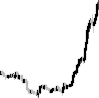
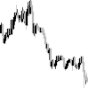
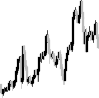
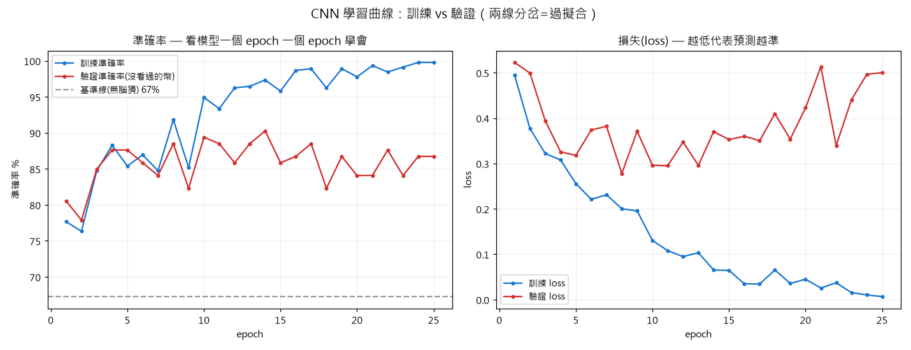
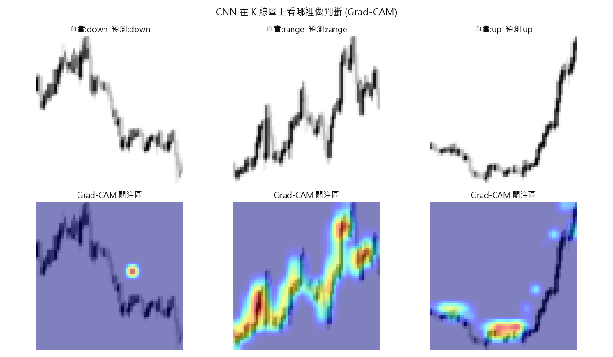

<div align="center">

# 🧠 K 線盤面型態辨識 CNN
### Chart-Pattern Recognition with a Convolutional Neural Network

**從原始 K 線「圖像」辨識盤面型態（上升 / 下降 / 盤整）**

[](https://pytorch.org)
[](https://pytorch.org/vision)

</div>

---

## 一句話

延續[趨勢線研究](TRENDLINE_RESEARCH.md)：把 A 階段的演算法當「自動標註器」，產生有標籤的 K 線圖資料集，訓練一個 CNN **直接從圖片**辨識盤面是上升、下降還是盤整 —— 並用**留一商品交叉驗證**確保分數可信。

> 嚴謹結果：對**從沒看過的商品**，5 折平均準確率 **85% (±3%)**，遠勝 62% 基準線。

---

## 管線（兩支程式）

### 1️⃣ `cv_dataset_gen.py` — 自動產生有標註的影像資料集
- 滑動視窗切出一段段 K 線（每張 100 根）
- 用迴歸斜率自動判定該段趨勢 → `up` / `down` / `range`（A 階段演算法當標註器）
- 渲染成**無座標軸的乾淨 K 線圖**（CNN 的純視覺輸入），按類別存資料夾
- 產出 565 張（5 個幣 × 113 張）

| 上升 up | 下降 down | 盤整 range |
|:---:|:---:|:---:|
|  |  |  |

### 2️⃣ `cv_train.py` — 訓練 + 嚴謹評估
- 小型 CNN（3 層卷積，灰階 64×64，CPU 可訓練）
- 類別不平衡 → `CrossEntropyLoss` 加類別權重
- **★ 留一商品交叉驗證**：輪流用 4 個幣訓練、留 1 個沒看過的幣驗證，跑 5 折

---

## ★ 為什麼不用「隨機切」訓練/驗證集（防資料洩漏）

資料集用滑動視窗（步長 8、視窗 100）產生，**相鄰兩張圖重疊 92%、幾乎相同**。
若用隨機切分，這些 near-duplicate 會同時落在訓練集與驗證集 → **資料洩漏(leakage)**，驗證分數虛高。

因此改用**按商品切**：訓練與驗證集是完全不同的幣、零重疊，分數才反映「對沒看過的盤面」的真實泛化能力。

> 實測：隨機切得 84%、按商品切得 85% —— 兩者接近，反而證明模型**不是靠洩漏**作弊，是真的學到型態。

---

## 結果（留一商品交叉驗證）

| 留作驗證的商品 | BNB | BTC | ETH | SOL | XRP | **平均** |
|---|---|---|---|---|---|---|
| 準確率 | 84% | 84% | 85% | 91% | 82% | **85% (±3%)** |

**彙總混淆矩陣**（每張圖都在「它是驗證集」那折被測過一次）：

| 真實＼預測 | down | range | up |
|---|---|---|---|
| **down** | 141 | 19 | 0 |
| **range** | 29 | 298 | 24 |
| **up** | 0 | 11 | 43 |

每類別準確率(recall)：**down 88%**、**range 85%**、**up 80%**。
基準線（無腦猜多數類 range）= 62% → 模型每類別都明顯勝出，且 **up↔down 零混淆**（從不把漲看成跌）。

---

## 📉 學習曲線：看模型學會 ＆ 抓出過擬合

`cv_learning_curve.py` 記錄每個 epoch 的訓練/驗證準確率與 loss（驗證用沒參與訓練的 XRP）。



- 前幾個 epoch 兩線一起爬上基準線之上 → **真的在學**。
- 但 ~epoch 10 後**訓練準確率→100%、訓練 loss→0，而驗證 loss 反而上升**、兩線分岔
  → 典型**過擬合(overfitting)**：模型在死背訓練資料，不是學通用型態。
- 結論：泛化最好的「甜蜜點」在 epoch 8–14，應用 **early stopping**，練越久反而有害。
  （這也示範了看懂學習曲線、判斷何時該停的能力。）

---

## 🔍 可解釋性：CNN 在看哪裡？(Grad-CAM)

`cv_explain.py` 用 Grad-CAM 產生熱力圖，標出模型判斷時最關注的區域（紅=高關注）。



**這同時是「誠實檢查」**：若熱點落在空白角落或某種假影 → 模型在作弊、85% 不可信；
實際上熱點全部落在**蠟燭走勢結構**上（上升圖集中在底部轉折與拉升段、盤整圖沿波動散布），
證明 CNN 是真的在「讀盤面」，結果可信。從「我訓練了分類器」升級到「我能解釋它學到什麼」。

---

## 誠實揭露的限制
- 任務是「辨識**眼前這段**長得像漲/跌/盤整」（描述性、可學），**不是預測未來**（那是另一個更難、且回測已知無 edge 的問題）。
- 標籤由迴歸斜率自動產生，本身帶有閾值的主觀性。
- 資料量小（565 張）、單一時間框（1h）。要產品化需更大、更多樣的資料與更強的模型。

---

## 技術棧
`PyTorch` · `torchvision`(ImageFolder) · `matplotlib`(資料生成) · `ccxt`(行情) · `NumPy`

## 執行
```bash
pip install torch torchvision --index-url https://download.pytorch.org/whl/cpu
python cv_dataset_gen.py   # 產生 data_cv/ 影像資料集
python cv_train.py         # 留一商品交叉驗證訓練 + 評估
```

---

<div align="center">

*本模組為 [Project F.O.X.](README.md) 的 CV 延伸；上游為[趨勢線研究](TRENDLINE_RESEARCH.md)。*

</div>
