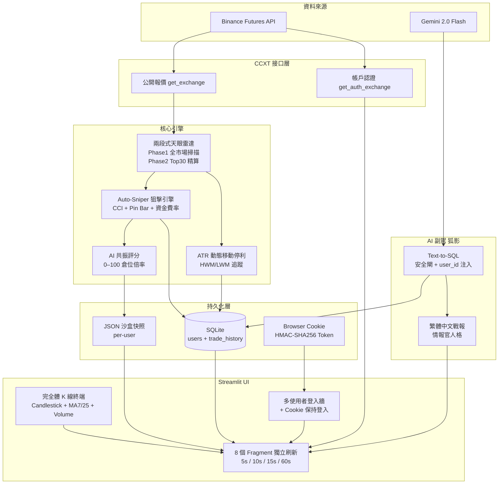

<div align="center">

# 🦊 Project F.O.X.
### Financial Operations eXecutor

**一套以容錯優先、資料驅動為核心的 AI 量化交易研究平台**

---

[](https://python.org)
[](https://streamlit.io)
[](https://plotly.com)
[](https://docker.com)
[](https://aistudio.google.com)
[](https://sqlite.org)
[](LICENSE)

</div>

---

## 設計哲學 Design Philosophy

Project F.O.X. 不是價格提醒工具，而是一套具備**完整交易生命週期管理**能力的量化研究平台。

| 原則 | 實踐方式 |
|------|----------|
| **輕量敏捷** | 全程 SQLite，無需 PostgreSQL / Redis，單容器即可運行 |
| **容錯優先** | 任何 API 失敗、網路閃斷均不中斷主引擎；異常靜默降級 |
| **多帳號資料隔離** | PBKDF2-SHA256 加密 + `user_id` FK 貫穿 DB / AI 查詢 / 沙盒存檔 |
| **AI 數據驅動** | Text-to-SQL 副駕強制注入 `WHERE user_id`，禁止跨帳資料洩漏 |
| **指標零依賴** | RSI / CCI / ATR 全程手工實作，計算邏輯完全可審計 |

---

## 核心功能 Key Features

### 📊 完全體 K 線看盤終端
- **Candlestick + 雙均線**：MA7（金黃 `#FFD700`）+ MA25（紫色 `#9B59B6`），`make_subplots` 雙層子圖
- **成交量副圖**：漲綠跌紅，半透明色彩，共享 X 軸縮放
- **時間級別自選**：1m / 5m / 15m / 30m / 1h / 4h / 1d，UTC+8 時區修正
- **多幣種即時切換**：BTC / ETH / ADA，切換時自動清空走勢快取與警報殘影

### 🚨 防殘影動態警報系統
- 跨幣種的價格地板線完整重置，杜絕「跌破 0 USDT」的舊幣顯示 Bug
- 1 分鐘急跌百分比偵測，`{:g}` 格式化確保小數幣正確顯示
- Windows Kernel32 Beep 聲音警報（非 Windows 靜默降級）

### 🤖 F.O.X. 狐影 AI 戰術副駕
- **流程**：自然語言 → Gemini 2.0 Flash → SQL → SQLite → 繁體中文戰報
- **安全閘**：`_is_safe_sql()` 只允許 `SELECT`，拒絕所有 DDL / DML
- **數據隔離**：Prompt 強制注入 `WHERE user_id = {uid}`，Gemini 無法查詢他人資料
- **自動修正**：SQL 執行失敗時帶錯誤訊息讓 Gemini 重試一次
- **人格核心**：情報官口吻，核心結論先行，禁止企業客服語句

### 🔐 多使用者身份系統
- **PBKDF2-HMAC-SHA256**：260,000 次迭代，16-byte urandom salt，`hmac.compare_digest()` 防時序攻擊
- **Cookie 保持登入**：HMAC-SHA256 簽名 Token，格式 `uid:username:expiry:sig`，7 天有效
- **Cookie 金鑰派生**：優先讀 `COOKIE_SECRET` 環境變數；未設定時自動從現有金鑰派生
- **Admin 自動建立**：首次啟動從 `ADMIN_DEFAULT_PWD` 環境變數建立管理員帳號
- **F5 刷新免登入**：自動還原 session state，登出時立即清除 Cookie

### ⚡ 兩段式廣域雷達（天眼）
- **Phase 1**：`fetch_tickers()` 全市場一次拉取，1 次 API 消耗完成掃描，按 |24h 漲跌幅| 降序
- **Phase 2**：Top 30 逐一取 K 線，0.1s 限速防封鎖，計算 RSI(14) / CCI(14) / ATR(14) + 資金費率
- **快取**：`@st.cache_data` TTL=20s，避免重複 API 呼叫

### 🎯 AI 共振評分引擎（0–100）

| 評分區間 | 倉位倍率 | 標籤 |
|---------|---------|------|
| ≥ 80 | × 1.5 | 🔥 絕殺 |
| 60–79 | × 1.0 | ✅ 標準 |
| < 60 | × 0.5 | 🔬 試水 |

### 📈 ATR 動態移動停利裝甲
```
追蹤距離 = 2 × ATR(14)
做多 → HWM − 追蹤距離  |  做空 → LWM + 追蹤距離
ATR = 0 時自動降級為固定 5%，確保舊倉位不報錯
```

---

## 極速啟動 Quick Start

### 方式一：Docker（推薦）

```bash
# 1. 複製專案
git clone https://github.com/sky5416841/Project_FOX.git
cd Project_FOX

# 2. 建立金鑰設定（複製範本後填入）
cp .env.example .env   # 或手動建立 .env

# 3. 一鍵啟動
docker compose up -d

# 瀏覽器開啟
open http://localhost:8501
```

> **數據持久化**：資料庫與沙盒存檔儲存於 Docker Named Volume `fox-data`，容器重啟後完整保留。

停止服務：
```bash
docker compose down          # 保留數據
docker compose down -v       # 連同數據一併清除
```

---

### 方式二：本機直接執行

```bash
git clone https://github.com/sky5416841/Project_FOX.git
cd Project_FOX

python -m venv .venv
.venv\Scripts\activate          # Windows
# source .venv/bin/activate     # macOS / Linux

pip install -r requirements.txt
```

建立 `.env`：

```env
# Binance API（選用：不填仍可使用公開報價與虛擬沙盒）
API_KEY=your_binance_api_key
API_SECRET=your_binance_api_secret

# Gemini API（選用：不填則 AI 副駕「狐影」離線）
GEMINI_API_KEY=your_gemini_api_key

# Cookie 簽名金鑰（選用：不填時自動派生）
# COOKIE_SECRET=your_random_secret_string

# 管理員帳號預設密碼（選用：首次啟動自動建立 admin）
# ADMIN_DEFAULT_PWD=your_admin_password
```

啟動：

```bash
streamlit run dashboard.py
# 瀏覽器開啟 http://localhost:8501
```

---

## 架構藍圖 Architecture Blueprint



---

## 專案結構

```
Project_FOX/
├── dashboard.py              # 主控台（Streamlit，~1,950 行）
├── database.py               # SQLite 多使用者持久化層
├── ai_copilot.py             # AI 副駕「狐影」（Text-to-SQL）
├── main.py                   # CLI 警報雷達（純 stdlib）
│
├── Dockerfile                # Multi-stage build，python:3.11-slim
├── docker-compose.yml        # fox-app 服務，Named Volume fox-data
├── .dockerignore             # 排除 .env / db / venv / __pycache__
├── requirements.txt          # 7 個依賴套件
└── .env                      # 金鑰設定（不納入版控）
```

---

## 技術棧 Tech Stack

| 層次 | 技術 | 版本 |
|------|------|------|
| Web UI | Streamlit | 1.35+ |
| 資料視覺化 | Plotly + make_subplots | 5.0+ |
| 交易所接口 | CCXT | 4.3+ |
| 資料處理 | Pandas | 2.0+ |
| 持久化 | SQLite3 (stdlib) | — |
| 密碼加密 | hashlib + hmac (stdlib) | PBKDF2-SHA256 |
| 持久登入 | streamlit-cookies-controller | 0.4+ |
| AI 副駕 | Google Gemini 2.0 Flash | — |
| 容器化 | Docker + Compose | — |
| 配置管理 | python-dotenv | 1.0+ |
| 金融指標 | 純 Python 自實作 | RSI / CCI / ATR |

---

## UI Fragment 架構

| Fragment | 刷新週期 | 職責 |
|---------|---------|------|
| `frag_sandbox` | 15s | 狙擊引擎心跳、移動停利、倉位 P&L |
| `frag_ticker` | 5s | 多幣種報價、警報觸發、帳戶餘額 |
| `frag_chart` | 60s | K 線圖渲染（Candlestick + MA + Volume） |
| `frag_scanner` | 20s | 天眼雷達掃描結果 |
| `frag_risk` | 10s | 風控大腦 + AI 決策日誌 |
| `frag_real_pos` | 10s | Binance 真實持倉 |
| `frag_virt_pos` | 5s | 虛擬沙盒倉位 + 績效 |
| `frag_cfo` | 15s | 資金曲線 + 統計指標 |

---

## 資料庫結構

```sql
CREATE TABLE users (
    id            INTEGER PRIMARY KEY AUTOINCREMENT,
    username      TEXT    NOT NULL UNIQUE,
    password_hash TEXT    NOT NULL   -- PBKDF2-HMAC-SHA256$iters$salt$dk
);

CREATE TABLE trade_history (
    id           INTEGER PRIMARY KEY AUTOINCREMENT,
    user_id      INTEGER NOT NULL DEFAULT 0,  -- → users.id
    timestamp    TEXT    NOT NULL,
    symbol       TEXT    NOT NULL,
    side         TEXT    NOT NULL,            -- Long / Short
    entry_price  REAL    NOT NULL,
    exit_price   REAL    NOT NULL,
    pnl          REAL    NOT NULL,            -- 正=獲利 負=損失 (USDT)
    score        INTEGER NOT NULL,            -- AI 共振評分 0–100
    exit_reason  TEXT    NOT NULL             -- 移動停利/動態停損/爆倉/手動平倉
);
```

> `init_db()` 冪等執行，舊資料庫自動 `ALTER TABLE` 補齊 `user_id` 欄位。

---

## 開發里程碑

| 階段 | 里程碑 |
|------|--------|
| Phase 1 | CLI 警報雷達，BTC/USDT 急跌偵測 + Kernel32 Beep |
| Phase 2 | Streamlit Dashboard，天眼全市場掃描器，RSI 動能偵測 |
| Phase 3 | CCI 刺客引擎、ATR 動態停利、CFO 資金曲線戰情室 |
| Phase 4 | SQLite 持久化、資金費率整合、AI 共振評分、動態倉位、虧損冷卻 |
| Phase 5 | AI 副駕「狐影」Text-to-SQL，Gemini 2.0 Flash，狐影人格注入 |
| Phase 6 | 多帳號 SaaS：PBKDF2 密碼加密、登入防護牆、per-user 沙盒隔離 |
| Phase 7 | 多幣種雷達（BTC/ETH/ADA）、防殘影警報系統、幣種同步切換 |
| Phase 8 | K 線完全體：Candlestick + MA7/MA25 + 成交量副圖 + UTC+8 修正 |
| Phase 9 | Cookie 保持登入：HMAC-SHA256 Token，7 天免登入，登出清除 |
| Phase 10 | Docker 容器化：Multi-stage build，Named Volume 持久化，`FOX_DATA_DIR` 環境隔離 |

---

## 免責聲明

本系統為**量化研究與教育用途**，虛擬沙盒中的所有交易均為模擬，不涉及真實資金操作。使用者若將本系統連接真實 Binance 帳戶查看持倉，須自行承擔相關責任。加密貨幣市場具有極高風險，本系統之任何信號輸出均不構成投資建議。

---

<div align="center">

**Project F.O.X.** — Built with precision. Designed for resilience.

</div>
