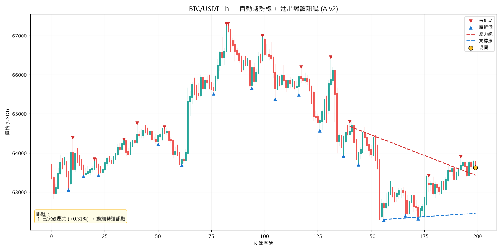

<div align="center">

# 📈 自動趨勢線偵測 × 嚴謹回測
### Algorithmic Trendline Detection & No-Lookahead Backtesting

**一個關於「盤面結構量化」與「誠實驗證」的研究筆記**

[](https://python.org)
[](https://github.com/ccxt/ccxt)
[](https://matplotlib.org)
[](https://numpy.org)

</div>

---

## 一句話

把交易員「看 K 線、畫趨勢線、判進出場」的直覺，拆解成**可解釋、可審計、可回測**的演算法 —— 並且**誠實地用無未來函數的回測，驗證這些訊號到底有沒有用**。

> 結論先講：本研究中的趨勢線訊號，扣成本後是**統計顯著的負期望**，且不優於隨機進場。
> 這個「否定的結果」正是重點 —— 它示範了**如何避免自欺**，而這是量化交易最稀缺的能力。

---

## 為什麼做這個

「盤面線圖辨識」的第一步，不是直接套深度學習，而是先用**透明的演算法**把人類交易員的判讀邏輯結構化：

1. 找出**轉折高/低點**（swing pivots）—— 盤面結構的骨架
2. 連出**支撐/壓力趨勢線** —— 結構的方向
3. 讀出**現價相對趨勢線的訊號** —— 進出場的依據

這套演算法畫出的線，未來可作為**電腦視覺（CNN）模型的訓練標註**，是 image-recognition 路線的地基。

---

## 兩個模組

### 1️⃣ `trendline_lab.py` — 偵測 + 繪製 + 讀訊號

| 步驟 | 方法 |
|------|------|
| 抓真實 K 線 | `ccxt` 公開行情 API（無需金鑰） |
| 轉折點偵測 | 某根高/低為左右各 *k* 根內的極值 → 認定為區域頂/底 |
| 趨勢線擬合 | 取最近 *N* 個轉折點，`np.polyfit` 最小平方擬合 |
| 進出場讀訊號 | 現價 vs 支撐/壓力線：接近支撐(潛在做多)／跌破支撐(停損)／突破壓力(動能轉強)／通道中段(觀望) |



> 紅 ▼/藍 ▲ 為演算法偵測的轉折點，紅/藍虛線為自動連出的壓力/支撐線，黃點為現價，左下角為自動讀出的訊號。

### 2️⃣ `trendline_backtest.py` — 嚴謹回測（本研究的核心）

逐根 K 線往前走，模擬「照訊號進場 → 持有固定根數 → 扣成本平倉」，統計每筆淨報酬。

**★ 工程重點：避免未來函數（Lookahead Bias）**

轉折點需要其後 *k* 根 K 線才能「確認」。因此在回測第 *t* 根做決策時，**只允許使用 index ≤ *t − k* 的轉折點**。偷看未來的回測一定很漂亮，但實盤會原形畢露 —— 這是回測最常見的致命錯誤，本研究從設計上杜絕。

**成本模型**：來回 0.2%（手續費 0.1% + 滑價估計 0.1%），與真實合約交易對齊。

---

## 回測結果（BTC/USDT 1h，1000 根，持有 10 根）

| 訊號 | 筆數 | 勝率 | 平均淨報酬 | 95% CI | t 值 | 判讀 |
|------|------|------|-----------|--------|------|------|
| 突破壓力做多 | 11 | 27% | **−0.68%/筆** | [−1.15, −0.20] | −2.81 | ❌ 顯著負 |
| 接近支撐做多 | 40 | 35% | **−0.41%/筆** | [−0.77, −0.04] | −2.19 | ❌ 顯著負 |
| 對照組：每根都做多 | 98 | 32% | −0.44%/筆 | [−0.69, −0.18] | −3.40 | ❌ 顯著負 |

**解讀：**
- 兩個趨勢線訊號扣費後皆為**統計顯著的負期望**（t < −1.96）。
- 更關鍵：它們**沒有優於對照組** —— 「突破壓力」甚至比隨機做多更差。代表訊號本身**未提供任何 alpha**，只是被動跟隨當期下行的市場。
- 這說明：一個視覺上「合理」的訊號，經嚴謹回測後可能毫無價值。**好看 ≠ 有 edge。**

> **限制（誠實揭露）**：單一商品、單一時間框、單一出場規則、約 42 天區間，且此區間偏空（對照組亦為負）。結論不宜外推為「趨勢線永遠無效」，但足以證明此 naive 版本無 edge。下一步應擴及多商品/多時間框/多出場規則，並納入做空。

---

## 為什麼這個「負結果」值得寫進作品

量化交易最稀缺的不是「會寫策略」，而是**有紀律地否定自己的策略**。本研究展示了：

- ✅ 把人類直覺**結構化為可審計的演算法**（非黑箱）
- ✅ 用**無未來函數**的回測框架驗證（避開最常見的自欺陷阱）
- ✅ 以**統計檢定 + 對照組**判斷 edge（而非單看勝率或單次盈虧）
- ✅ **誠實揭露限制與否定結論**，不為了好看而隱藏

這套思維，正是「不會拿未驗證的訊號去冒真錢」的專業底線。

---

## 技術棧

`Python` · `ccxt`（行情）· `NumPy`（向量化計算 / 最小平方擬合）· `pandas` · `matplotlib`（K 線視覺化）

## 執行方式

```bash
pip install ccxt numpy pandas matplotlib
python trendline_lab.py        # 產生標註趨勢線的 K 線圖 (PNG)
python trendline_backtest.py   # 跑無未來函數回測，輸出各訊號淨期望
```

## 路線圖 Roadmap

- [x] **A. 演算法畫線 + 讀訊號 + 嚴謹回測** ← 本筆記
- [x] **B. 電腦視覺**：以 A 的演算法自動標註，訓練 CNN 從圖像辨識盤面型態
      → 見 [CV_CLASSIFIER.md](CV_CLASSIFIER.md)（留一商品交叉驗證 85%）
- [ ] 多商品 / 多時間框 / 多出場規則的網格回測

---

<div align="center">

*本研究為 [Project F.O.X.](README.md) 量化研究平台的延伸模組。*

</div>
